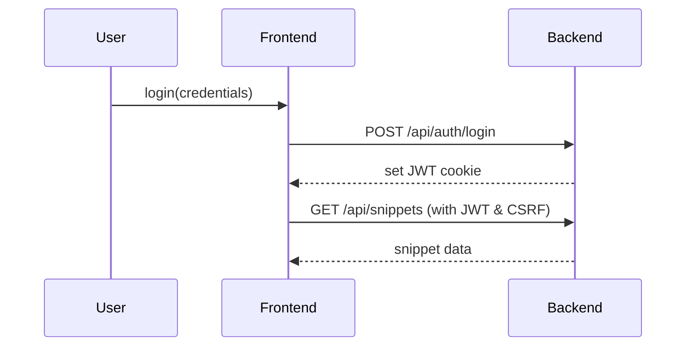

# SnippetLab – CODE-EDITOR

A full-stack web application for managing and executing code snippets, designed for developers to create, organize, and run snippets directly in the browser.

## Table Contents

1. [Features](#features)
2. [Architecture Overview](#architecture-overview)
3. [Tech Stack](#tech-stack)
4. [Getting Started](#getting-started)
5. [Usage Examples](#usage-examples)
6. [Project Structure](#project-structure)
7. [Contributing](#contributing)
8. [Troubleshooting \& Support](#troubleshooting--support)
9. [Future Roadmap](#future-roadmap)

## Features

- **Code Snippet Management**: Create, read, update, delete, and organize snippets.
- **Multi-language Support**: Run snippets in C++, JavaScript, Python, Java, and more.
- **Real-time Execution**: Execute code in-browser with immediate output.
- **User Authentication**: Secure sign-up/login with JWT and CSRF protection.
- **Responsive Design**: Optimized for desktop, tablet, and mobile.
- **Rate Limiting \& Security**: Helmet for headers, rate limiting, input validation, sanitization.


## Architecture Overview

### System Architecture

Frontend and backend communicate via RESTful API.

```mermaid
graph TD
  A[Browser Client] -->|HTTPS| B[Frontend (Next.js)]
  B -->|REST API| C[Backend (Express.js)]
  C --> D[(MongoDB Atlas)]
  C --> E[Code Execution Service]
```


### Authentication Flow

Secure token exchange with CSRF protection.




## Tech Stack

| Layer | Technology |
| :-- | :-- |
| Frontend | Next.js 14 -  React 18 -  TypeScript -  TailwindCSS -  Zustand |
| Backend | Node.js 18 -  Express.js -  TypeScript -  Mongoose |
| Database | MongoDB Atlas |
| DevOps | GitHub Actions -  Render hosting |
| Testing | Jest -  Supertest -  MongoDB Memory Server |

## Getting Started

### Prerequisites

- Node.js ≥18
- npm ≥7
- MongoDB URI


### Installation

```bash
# Clone repo
git clone https://github.com/codexdhruv11/CODE-EDITOR.git
cd CODE-EDITOR

# Install dependencies
cd code-craft-frontend && npm install
cd ../code-craft-backend && npm install
```


### Environment Variables

Create a `.env` in `code-craft-backend`:

```env
NODE_ENV=production
PORT=5000
MONGODB_URI=your_mongodb_uri
JWT_SECRET=your_jwt_secret
CORS_ORIGIN=https://your-frontend-url
```

In Render dashboard for frontend:

```
NEXT_PUBLIC_API_URL=https://your-backend-url/api
```


### Running Locally

```bash
# Backend
cd code-craft-backend
npm run dev

# Frontend
cd ../code-craft-frontend
npm run dev
```


## Usage Examples

### Fetch All Snippets (Frontend)

```typescript
import axios from 'axios';

axios.get('/api/snippets')
  .then(res => console.log(res.data))
  .catch(err => console.error(err));
```


### Create a New Snippet (Backend)

```http
POST /api/snippets
Content-Type: application/json
Authorization: Bearer <JWT>

{ "title": "Hello World", "code": "console.log('Hello');", "language": "javascript" }
```


## Project Structure

```text
.
├─ code-craft-frontend/    # Next.js app
│  ├─ src/
│  │  ├─ app/
│  │  ├─ components/
│  │  └─ hooks/
├─ code-craft-backend/     # Express API
│  ├─ src/
│  │  ├─ controllers/
│  │  ├─ middleware/
│  │  ├─ models/
│  │  ├─ routes/
│  │  └─ utils/
└─ README.md               # This file
```


## Contributing

1. Fork the repo
2. Create a feature branch (`git checkout -b feature/...`)
3. Commit your changes
4. Open a pull request

Please follow the existing code style and add tests for new functionality.

## Troubleshooting \& Support

- **Build Errors**: Verify Node.js version and environment variables.
- **API Errors**: Check CORS settings and backend health at `/api/health`.
- **Database Issues**: Confirm MongoDB URI validity and cluster status.


## Future Roadmap

- Add user roles \& permissions
- Implement snippet tagging \& search
- Enable real-time collaboration
- Integrate third-party API execution

*Happy coding!*

<div style="text-align: center">⁂</div>

[^1]: CODE.txt

