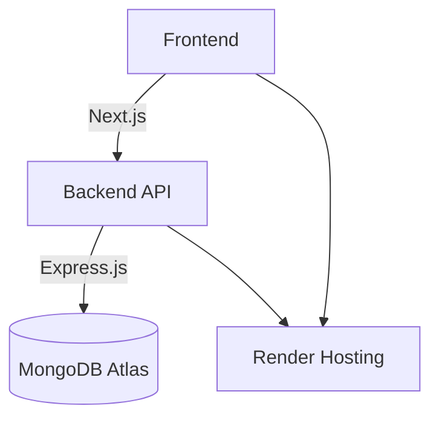
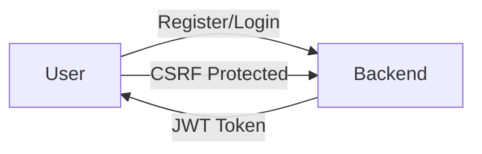

# SnippetLab - CODE-EDITOR


[](https://github.com/codexdhruv11/CODE-EDITOR/actions)   

## Table of Contents
- [Project Overview](#project-overview)
- [Tech Stack](#tech-stack)
- [Features](#features)
- [Architecture](#architecture)
- [System Requirements](#system-requirements)
- [Installation & Setup](#installation--setup)
- [Deployment Guide](#deployment-guide)
- [API Documentation](#api-documentation)
- [Usage Examples](#usage-examples)
- [Contributing](#contributing)
- [License](#license)
- [Changelog](#changelog)
- [Troubleshooting](#troubleshooting)
- [Performance Optimizations](#performance-optimizations)
- [Security Considerations](#security-considerations)
- [Future Roadmap](#future-roadmap)

## Project Overview
CODE-EDITOR (SnippetLab) is a full-stack web application for managing and executing code snippets. Designed for developers, it offers a user-friendly interface with extensive features for code management and execution directly in the browser.

- **Project Name**: CODE-EDITOR (SnippetLab)
- **Repository**: [GitHub](https://github.com/codexdhruv11/CODE-EDITOR)
- **Live URLs**:
  - [Frontend](https://code-editor-j5qq.onrender.com)
  - [Backend API](https://code-editor-backend-26a6.onrender.com)

## Tech Stack
### Frontend
- Next.js 14.0.3 with App Router
- React 18 with TypeScript
- TailwindCSS for styling
- Zustand for state management
- Monaco Editor for code editing

### Backend
- Node.js with TypeScript
- Express.js framework
- MongoDB with Mongoose ODM
- JWT authentication with CSRF protection

### Database
- MongoDB Atlas cluster
- User authentication and snippet storage
- TLS/SSL encryption enabled

### DevOps & Deployment
- GitHub Actions for CI/CD
- Simultaneous deployment pipeline
- Render cloud hosting

## Features
- **Code Snippet Management**: Create, edit, delete, and organize snippets.
- **Multi-language Support**: Execute code in C++, JavaScript, Python, Java, and more.
- **Real-time Code Execution**: Execute code snippets in the browser.
- **User Authentication**: Secure registration/login with JWT tokens.
- **Responsive Design**: Desktop, tablet, and mobile support.

## Architecture
### System Architecture


### Authentication Flow


## System Requirements
- Node.js >= 18.0.0
- npm >= 7.0.0

## Installation & Setup
1. Clone the repository:
   ```sh
   git clone https://github.com/codexdhruv11/CODE-EDITOR.git
   ```
2. Install dependencies for both frontend and backend:
   ```sh
   cd CODE-EDITOR/code-craft-frontend && npm install
   cd ../code-craft-backend && npm install
   ```
3. Set environment variables:
   - **NODE_ENV**: production
   - **MONGODB_URI**: Your MongoDB connection string
   - **JWT_SECRET**: Your JWT secret

## Deployment Guide
This project uses Render for seamless cloud deployment. Follow these steps for deployment:
1. Update the `render.yaml` with your repository details.
2. Set the necessary environment variables in Render dashboard.
3. Use GitHub Actions for automated deployment.

## API Documentation
The backend API supports several endpoints for managing code snippets:
- **GET /api/snippets**: Retrieve all snippets
- **POST /api/snippets**: Create a new snippet

## Usage Examples
```typescript
import axios from 'axios';
axios.get('/api/snippets')
  .then(response => console.log(response.data))
  .catch(error => console.error(error));
```

## Contributing
We welcome contributions! Please read our [CONTRIBUTING.md](CONTRIBUTING.md) for more information.

## License
This project is licensed under the MIT License.

## Changelog
See [CHANGELOG.md](CHANGELOG.md) for details on version changes.

## Troubleshooting
If you encounter issues, check:
- MongoDB URI and connection
- JWT configurations

## Performance Optimizations
- Utilize code splitting in Next.js
- Apply database indexing for common queries

## Security Considerations
- Enable TLS/SSL for all connections
- Secure environment variables management

## Future Roadmap
- Add more pre-built algorithms
- Integrate with additional third-party APIs

---

> This README serves as both a documentation resource and a showcase for the CODE-EDITOR project. We strive to maintain a high standard in both functionality and presentation.
